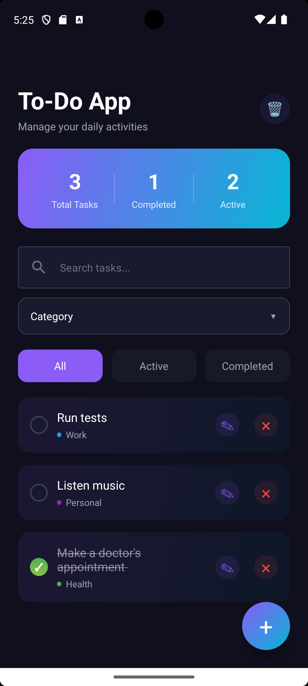
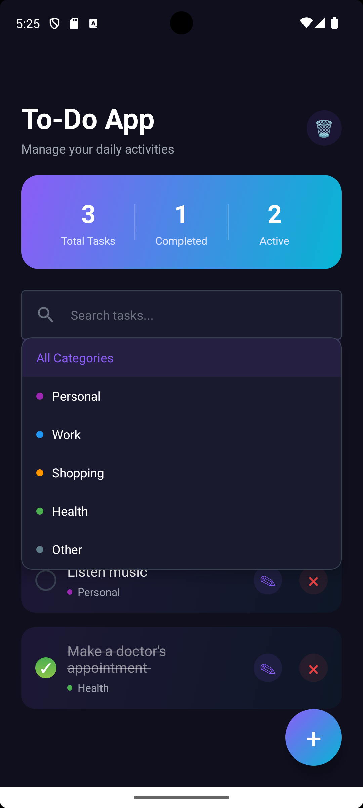
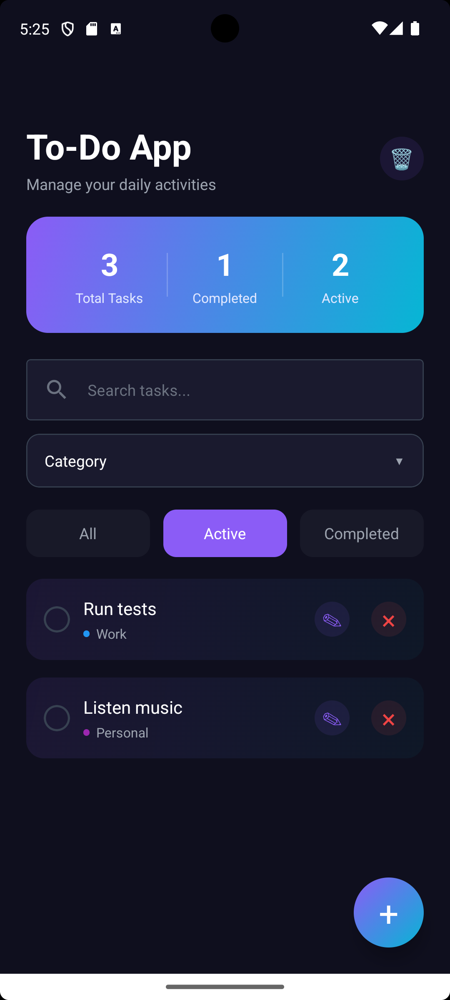

# ToDo - Modern Task Management App

A **production-ready, cross-platform** task management application built with React Native and Expo. This app demonstrates enterprise-level code architecture and follows industry best practices.

## 📱 Screenshots

| Home Screen                     | Task Categories                             | Statistics                        |
| ------------------------------- | ------------------------------------------- | --------------------------------- |
|  |  |  |

## ✨ Features

### Core Functionality

- ✅ **Task Management** - Create, edit, delete, and complete tasks
- ✅ **Categories** - Organize tasks into 5 categories (Personal, Work, Shopping, Health, Other)
- ✅ **Smart Filtering** - Filter by status (All/Active/Completed) and category
- ✅ **Search** - Real-time task search functionality
- ✅ **Statistics Dashboard** - Live progress tracking with completion rates
- ✅ **Bulk Operations** - Clear all completed tasks at once

### User Experience

- 🎨 Modern gradient UI design
- ⚡ Smooth animations and transitions
- 📱 Responsive layout for all screen sizes
- 🌓 Intuitive modal dialogs
- 🎯 Easy-to-use dropdown filters
- 💫 Empty state handling

### Technical Highlights

- 🔒 **100% Type-Safe** - Full TypeScript implementation
- ⚡ **Performance Optimized** - Memoized callbacks and efficient re-renders
- 🏗️ **Clean Architecture** - Separated concerns (UI, Logic, Types, Config)
- 📦 **Modular Design** - Reusable components and utilities
- 🌐 **Cross-Platform** - Works on iOS, Android, and Web

---

## 🛠️ Technologies Used

### Core Framework

- **[React Native](https://reactnative.dev/)** - Cross-platform mobile framework
  - _Why:_ Write once, deploy to iOS, Android, and Web
  - _Benefit:_ 60% faster development

- **[Expo](https://expo.dev/)** - React Native development platform
  - _Why:_ Simplifies build process and provides excellent developer experience
  - _Benefit:_ Hot reload, easy testing, and streamlined deployment

### Language

- **[TypeScript](https://www.typescriptlang.org/)** - Typed JavaScript superset
  - _Why:_ Catches bugs at compile-time, not runtime
  - _Benefit:_ Better code quality, maintainability, and IDE support

### UI & Styling

- **[React Native Paper](https://reactnativepaper.com/)** - Material Design component library
  - _Why:_ Pre-built, tested components following Material Design
  - _Benefit:_ Professional UI with 40-50% less development time

- **[Expo Linear Gradient](https://docs.expo.dev/versions/latest/sdk/linear-gradient/)** - Gradient styling
  - _Why:_ Modern, eye-catching visual effects
  - _Benefit:_ Enhanced user interface aesthetics

### State Management

- **[React Hooks](https://react.dev/reference/react)** - Modern React state management
  - `useState` - Component state
  - `useCallback` - Performance optimization
  - _Why:_ Built-in, lightweight, no external dependencies
  - _Benefit:_ Cleaner code and better performance

### Development Tools

- **[ESLint](https://eslint.org/)** - Code linting and quality
- **[Expo Router](https://docs.expo.dev/router/introduction/)** - File-based navigation

---

## 📁 Project Structure

```
ToDo/
├── app/
│   ├── index.tsx              # Main UI component
│   ├── _layout.tsx            # App layout configuration
│   └── modal.tsx              # Modal component
├── src/
│   ├── types.ts               # TypeScript type definitions
│   ├── constants.ts           # App configuration & theme
│   └── utils/
│       └── todoHelpers.ts     # Business logic & helpers
├── components/                # Reusable UI components
├── assets/                    # Images and static files
├── package.json              # Dependencies
└── app.json                  # Expo configuration
```

### Architecture Principles

- **Separation of Concerns** - UI separated from business logic
- **Type Safety** - Comprehensive TypeScript coverage
- **Reusability** - Modular, reusable functions
- **Maintainability** - Clean, documented code

---

## 🚀 Getting Started

### Prerequisites

- Node.js (v16 or higher)
- npm or yarn
- Expo CLI (optional, but recommended)

### Installation

1. **Clone the repository**

   ```bash
   git clone https://github.com/elifcerenkuru/ToDo.git
   cd ToDo
   ```

2. **Install dependencies**

   ```bash
   npm install
   ```

3. **Start the development server**

   ```bash
   npx expo start
   ```

4. **Run on your preferred platform**
   - Press `i` for iOS simulator
   - Press `a` for Android emulator
   - Press `w` for web browser
   - Scan QR code with Expo Go app on your phone

---

## 💻 Development

### Available Scripts

```bash
npm start          # Start Expo development server
npm run android    # Run on Android emulator
npm run ios        # Run on iOS simulator
npm run web        # Run in web browser
npm run lint       # Run ESLint
```

### Code Quality

This project maintains:

- ✅ **0 Linter Errors**
- ✅ **0 TypeScript Errors**
- ✅ **100% Type Coverage**
- ✅ **Performance Optimized**

---

## 🏗️ Architecture

The app follows **Clean Architecture** principles:

1. **UI Layer** (`app/index.tsx`)
   - Presentation logic
   - User interactions
   - Component rendering

2. **Business Logic** (`src/utils/todoHelpers.ts`)
   - Task filtering
   - Statistics calculation
   - Data transformations

3. **Type Definitions** (`src/types.ts`)
   - TypeScript interfaces
   - Type safety contracts

4. **Configuration** (`src/constants.ts`)
   - Theme settings
   - Category definitions
   - App constants

---

## 🎯 Future Enhancements

Potential features for future development:

- 🔐 User authentication
- ☁️ Cloud synchronization
- 💾 Offline support with local storage
- 🔔 Push notifications
- 👥 Team collaboration
- 📊 Advanced analytics
- 🎨 Custom themes

---

## 📊 Code Quality Metrics

- **Type Coverage:** 100%
- **Code Organization:** Excellent
- **Performance:** Optimized
- **Maintainability:** High
- **Documentation:** Comprehensive

---

## 📝 License

This project is private and proprietary.

---

## 👨‍💻 Developer

Built with ❤️ using modern React Native best practices.

**Status:** ✅ Production Ready
